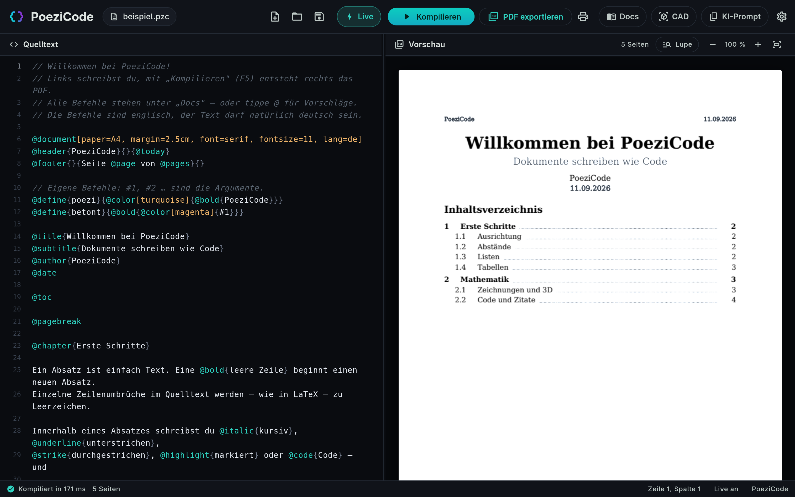
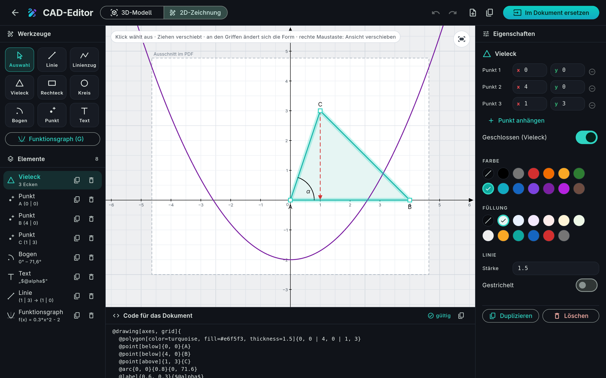
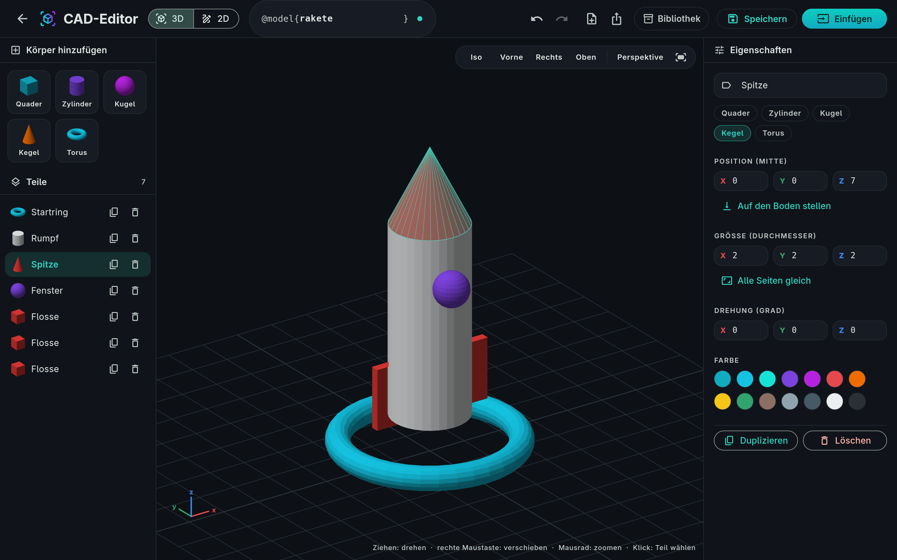
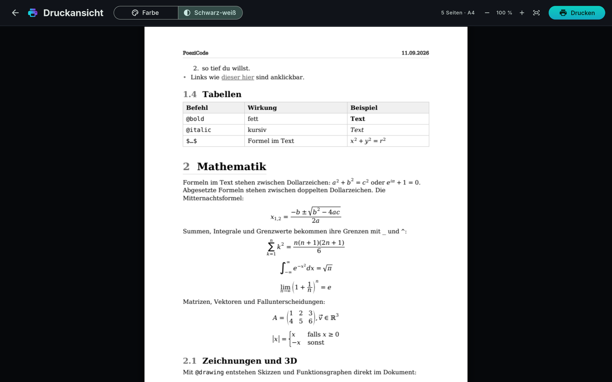

<p align="center">
  
</p>

<h1 align="center">PoeziCode</h1>

<p align="center">
  <b>Dokumente schreiben wie Code – und ein sauberes PDF bekommen.</b><br>
  Überschriften, Formeln, Tabellen, Zeichnungen und 3D-Modelle als Text, mit Live-Vorschau daneben.
</p>

<p align="center">
  <a href="https://github.com/poezi123/poezicode/releases/latest"></a>
  <a href="https://github.com/poezi123/poezicode/releases"></a>
  
  <a href="LICENSE.md"></a>
</p>

<p align="center">
  <a href="#download">Download</a> ·
  <a href="#installation">Installation</a> ·
  <a href="#schnellstart">Schnellstart</a> ·
  <a href="#funktionen">Funktionen</a> ·
  <a href="#fragen">Fragen</a> ·
  <a href="README.md">English</a>
</p>

<p align="center">
  
</p>

---

## Was ist PoeziCode?

PoeziCode ist wie Word – nur dass du dein Dokument **als Text schreibst**. Eine kurze,
lesbare Sprache sagt, was wohin gehört, und PoeziCode setzt daraus ein ordentliches PDF.
Wer Markdown oder LaTeX kennt, findet sich schnell zurecht, braucht aber keins von beidem:
keine TeX-Installation, keine Pakete, keine Build-Skripte. Installieren, tippen, <kbd>F5</kbd>.

```poezicode
@document[paper=A4, lang=de]

@title{Mein erstes Dokument}
@author{Max Mustermann}

@chapter{Einleitung}

PoeziCode macht aus @bold{einfachem Text} ein sauberes PDF.
Formeln stehen zwischen Dollarzeichen: $a^2 + b^2 = c^2$.

$$ x_{1,2} = @frac{-b +- @sqrt{b^2 - 4ac}}{2a} $$

@note{Mit @bold{F5} kompilieren – oder @italic{Live} einschalten.}

@drawing[axes, grid]{
  @plot{x^2 - 2}
  @point[below]{0,-2}{$S$}
}{Eine Parabel}
```

<a id="download"></a>

## Download

| System | Paket | |
|---|---|---|
| **Windows 10 / 11** (64 Bit) – Installer | `poezicode-0.2.0-windows-x64-setup.exe` | [Download](https://github.com/poezi123/poezicode/releases/download/v0.2.0/poezicode-0.2.0-windows-x64-setup.exe) |
| **Windows 10 / 11** (64 Bit) – zum Entpacken, ohne Installation | `poezicode-0.2.0-windows-x64.zip` | [Download](https://github.com/poezi123/poezicode/releases/download/v0.2.0/poezicode-0.2.0-windows-x64.zip) |
| **Arch Linux**, CachyOS, Manjaro, EndeavourOS | `poezicode-0.2.0-1-x86_64.pkg.tar.zst` | [Download](https://github.com/poezi123/poezicode/releases/download/v0.2.0/poezicode-0.2.0-1-x86_64.pkg.tar.zst) |
| **Ubuntu 24.04+**, Debian 13, Linux Mint 22 | `poezicode_0.2.0_amd64.deb` | [Download](https://github.com/poezi123/poezicode/releases/download/v0.2.0/poezicode_0.2.0_amd64.deb) |
| **Alle anderen Linux-Systeme** (Fedora, openSUSE …) | `poezicode-0.2.0-linux-x64.tar.gz` | [Download](https://github.com/poezi123/poezicode/releases/download/v0.2.0/poezicode-0.2.0-linux-x64.tar.gz) |

Alle Versionen und Prüfsummen (`SHA256SUMS.txt`) stehen auf der
[Release-Seite](https://github.com/poezi123/poezicode/releases).

**Voraussetzungen:** Windows 10 oder 11 (64 Bit) – oder Linux auf x86_64 mit glibc 2.38 oder neuer
und GTK 3, also Ubuntu 24.04, Debian 13, Fedora 39 oder ein aktuelles Arch-basiertes System.

<a id="installation"></a>

## Installation

**Windows** – `poezicode-0.2.0-windows-x64-setup.exe` starten. Administratorrechte braucht es
nicht: PoeziCode wird für deinen Benutzer installiert, steht im Startmenü, und `.pzc`-Dateien
öffnen sich damit. Der Installer ist noch nicht signiert, deshalb meldet Windows SmartScreen
womöglich *„Der Computer wurde durch Windows geschützt“* – dann **Weitere Informationen → Trotzdem
ausführen**. Lieber ohne Installation? Das ZIP entpacken und `poezicode.exe` starten.

**Arch Linux und Ableger**

```sh
sudo pacman -U poezicode-0.2.0-1-x86_64.pkg.tar.zst
```

**Ubuntu, Debian, Linux Mint** – Datei doppelt anklicken, oder:

```sh
sudo apt install ./poezicode_0.2.0_amd64.deb
```

**Alle anderen Distributionen** – ohne Administratorrechte:

```sh
tar xzf poezicode-0.2.0-linux-x64.tar.gz
cd poezicode-0.2.0-linux-x64
./install.sh        # trägt PoeziCode ins Anwendungsmenü ein (~/.local)
# oder direkt starten:  ./poezicode
```

**Download prüfen** (optional):

```sh
sha256sum -c SHA256SUMS.txt --ignore-missing
```

Unter Windows in PowerShell: `Get-FileHash poezicode-0.2.0-windows-x64-setup.exe` und den Wert mit
`SHA256SUMS.txt` vergleichen.

Unter Linux steht PoeziCode danach im Anwendungsmenü, und `.pzc`-Dateien öffnen sich damit.
Im Terminal: `poezicode` oder `poezicode mein-dokument.pzc`.

<a id="schnellstart"></a>

## Schnellstart

1. PoeziCode starten – beim ersten Start öffnet sich ein Beispieldokument, das alles zeigt
   (liegt auch in [examples/](examples/)).
2. Links tippen. Ist **Live** an, aktualisiert sich das PDF rechts beim Schreiben, sonst
   <kbd>F5</kbd> drücken.
3. `@` tippen für Vorschläge – oder **Docs** (<kbd>F1</kbd>) öffnen: alle Befehle mit einem Satz
   Beschreibung.
4. Speichern mit <kbd>Strg</kbd>+<kbd>S</kbd>, PDF exportieren mit <kbd>Strg</kbd>+<kbd>E</kbd>,
   drucken mit <kbd>Strg</kbd>+<kbd>P</kbd>.

### Die wichtigsten Befehle

| Was | Schreibweise |
|---|---|
| Seite einrichten | `@document[paper=A4, margin=2.5cm, font=serif, fontsize=11, lang=de]` |
| Titel, Inhaltsverzeichnis | `@title{…}` `@author{…}` `@date` `@toc` |
| Überschriften (nummeriert) | `@chapter{…}` `@section{…}` `@subsection{…}` |
| Text | `@bold{…}` `@italic{…}` `@underline{…}` `@highlight{…}` `@color[red]{…}` |
| Formeln | `$a^2 + b^2$` im Text, `$$ … $$` abgesetzt, `@frac{a}{b}` `@sqrt{x}` `@sum_{k=1}^{n}` |
| Listen und Tabellen | `@list{ @item{…} }` `@numbered{ … }` `@table[header]{ @row{A \| B} }` |
| Kästen und Zitate | `@note{…}` `@warning{…}` `@quote{…}{Quelle}` `@codeblock[dart]{…}` |
| Layout | `@center{…}` `@right{…}` `@columns{…}{…}` `@block[top=1cm, left=2cm]{…}` `@newln` `@pagebreak` |
| Bilder | `@image[width=50%]{foto.png}{Bildunterschrift}` |
| Zeichnungen und 3D | `@drawing[axes]{ @line{0,0}{3,2} @circle{1,1}{0.5} @plot{sin(x)} }` `@surface{x^2 - y^2}` `@model{name}` |
| Kopf- und Fußzeile | `@header{links}{Mitte}{rechts}` `@footer{}{Seite @page von @pages}{}` |
| Eigene Befehle | `@define{wichtig}{@bold{@color[red]{#1}}}` → `@wichtig{Text}` |

Die Befehle sind englisch, der Text darf natürlich deutsch sein.

<a id="funktionen"></a>

## Funktionen

- **Live-Vorschau** – das PDF wird im Hintergrund gesetzt, während du tippst, scharf in jeder Größe.
- **Eigene Sprache** – kurze, lesbare Befehle, verständliche Fehlermeldungen mit Vorschlägen
  (*„Meintest du @italic?"*) und Vorschläge beim Tippen.
- **Echter Formelsatz** – Brüche, Wurzeln, Summen, Integrale, Matrizen und Fallunterscheidungen.
- **Zeichnungen im Dokument** – Koordinatensysteme, Funktionsgraphen, Geometrie mit
  Beschriftungen und Formeln, alles als Vektorgrafik.
- **3D** – STL/OBJ-Modelle oder eigene Modelle aus dem CAD-Editor einfügen, dazu Funktionsflächen
  wie `@surface{x^2 - y^2}`.
- **CAD-Editor** – 3D-Modelle aus Grundkörpern bauen oder 2D-Zeichnungen mit der Maus zeichnen
  und den passenden `@drawing`-Code bekommen. Steht der Cursor in einer Zeichnung, wird genau diese bearbeitet.
- **Lupe** – ein Wort, eine Formel oder Grafik im PDF anklicken, und der Editor springt zur
  Stelle im Quelltext. Geht auch mit <kbd>Strg</kbd>+Klick.
- **Druckansicht** – in Farbe oder Schwarz-weiß, bevor der Druckdialog aufgeht.
- **KI-Prompt** – ein Klick kopiert eine Anleitung, mit der ChatGPT, Claude & Co. PoeziCode für
  dich schreiben.
- **Deutsch und Englisch** – Oberfläche, Meldungen und Befehlsbeschreibungen in beiden Sprachen.
- **Inhaltsverzeichnis, Lesezeichen und Links** – im PDF anklickbar.

<p align="center">
  
  
</p>
<p align="center">
  
</p>

## Tastenkürzel

| Tasten | Aktion |
|---|---|
| <kbd>F5</kbd> / <kbd>Strg</kbd>+<kbd>Enter</kbd> | Kompilieren |
| <kbd>Strg</kbd>+<kbd>S</kbd> · <kbd>Strg</kbd>+<kbd>Umschalt</kbd>+<kbd>S</kbd> | Speichern · speichern unter |
| <kbd>Strg</kbd>+<kbd>O</kbd> · <kbd>Strg</kbd>+<kbd>N</kbd> | Öffnen · neu |
| <kbd>Strg</kbd>+<kbd>E</kbd> | PDF exportieren |
| <kbd>Strg</kbd>+<kbd>P</kbd> | Druckansicht |
| <kbd>F1</kbd> | Docs-Fenster |
| <kbd>Strg</kbd>+<kbd>,</kbd> | Einstellungen |

<a id="fragen"></a>

## Häufige Fragen

**Ist PoeziCode Open Source?**
Nein. PoeziCode ist kostenlos und die Pakete dürfen weitergegeben werden, der Quellcode wird aber
nicht veröffentlicht. Siehe [LICENSE.md](LICENSE.md).

**Ist das LaTeX?**
Nein. PoeziCode hat eine eigene Sprache, von LaTeX inspiriert, aber einfacher, und braucht keine
TeX-Installation.

**Darf ich meine Dokumente kommerziell nutzen?**
Ja. Deine Dokumente, PDFs, Zeichnungen und Modelle gehören dir, ohne Einschränkungen.

**Wie bringe ich eine KI dazu, PoeziCode zu schreiben?**
Oben auf **KI-Prompt** klicken, in den KI-Chat einfügen und am Ende beschreiben, was im Dokument
stehen soll.

**Wo liegen Einstellungen und Modelle?**
Windows: `%APPDATA%\PoeziCode` · Linux: `~/.local/share/de.poezicode.poezicode/`.
Beim Deinstallieren bleiben sie erhalten.

**Wie deinstalliere ich es?**
Windows: Einstellungen → Apps → PoeziCode (oder beim ZIP einfach den Ordner löschen) ·
`sudo pacman -R poezicode` · `sudo apt remove poezicode` · oder `./uninstall.sh` bei der tar.gz-Version.

**Warum warnt Windows vor dem Installer?**
Der Installer ist noch nicht signiert, und SmartScreen warnt vor neuen Programmen, die es nicht
kennt. Wer sichergehen will, vergleicht die Prüfsumme mit `SHA256SUMS.txt` und wählt dann
**Weitere Informationen → Trotzdem ausführen**.

**Ich habe einen Fehler gefunden oder eine Idee.**
Bitte ein [Issue](https://github.com/poezi123/poezicode/issues) eröffnen – wenn möglich mit dem
Dokument, bei dem es passiert.

## Lizenz

PoeziCode ist **kostenlos nutzbar** – privat und beruflich –, und die unveränderten Pakete dürfen
weitergegeben werden. Verkaufen oder Verändern ist nicht erlaubt. Einzelheiten:
[LICENSE.md](LICENSE.md). Fremdkomponenten und ihre Lizenzen:
[THIRD_PARTY_NOTICES.md](THIRD_PARTY_NOTICES.md).

<p align="center"><sub>© 2026 poezi123</sub></p>
