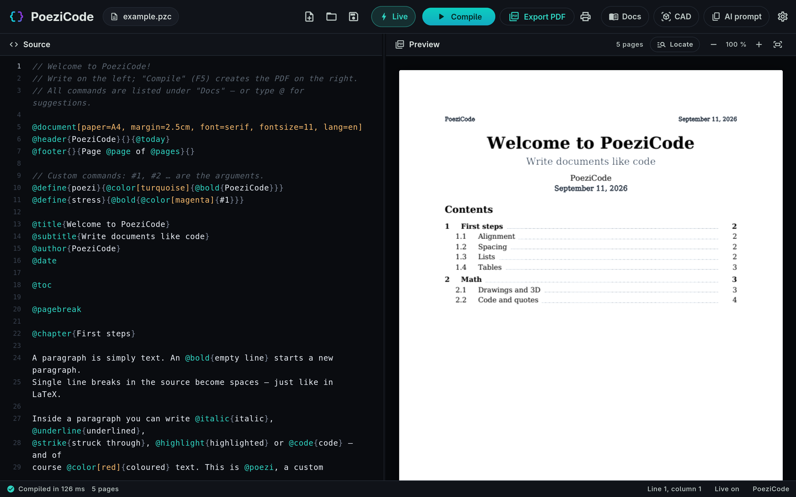
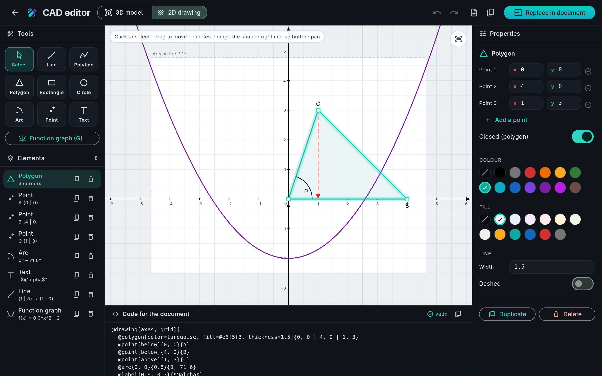
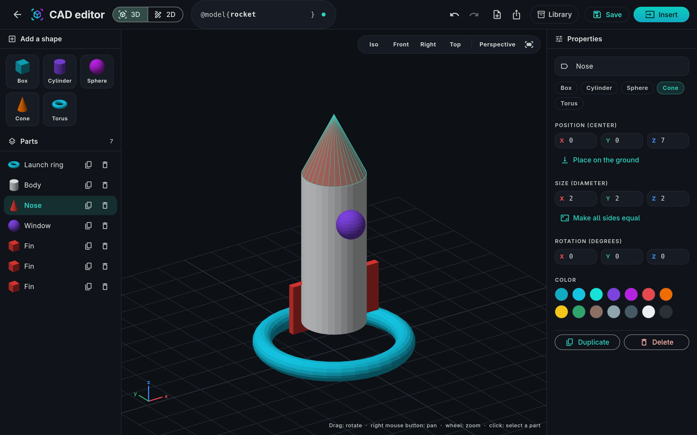
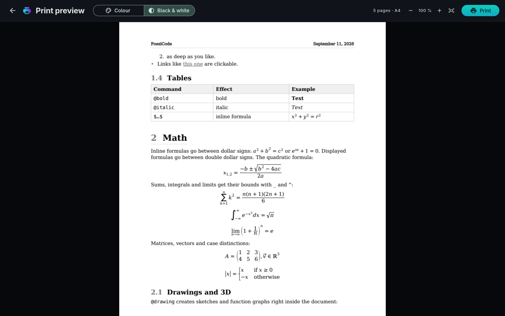

<p align="center">
  
</p>

<h1 align="center">PoeziCode</h1>

<p align="center">
  <b>Write documents like code – get a clean PDF.</b><br>
  Headings, formulas, tables, drawings and 3D models as plain text, with a live preview next to it.
</p>

<p align="center">
  <a href="https://github.com/poezi123/poezicode/releases/latest"></a>
  <a href="https://github.com/poezi123/poezicode/releases"></a>
  
  <a href="LICENSE.md"></a>
</p>

<p align="center">
  <a href="#download">Download</a> ·
  <a href="#installation">Installation</a> ·
  <a href="#quick-start">Quick start</a> ·
  <a href="#features">Features</a> ·
  <a href="#faq">FAQ</a> ·
  <a href="README.de.md">Deutsch</a>
</p>

<p align="center">
  
</p>

---

## What is PoeziCode?

PoeziCode is like a word processor – except that you **write your document as text**.
A short, readable language describes what goes where; PoeziCode sets it into a tidy PDF.
If you know Markdown or LaTeX you will feel at home quickly, but you need neither: no TeX
installation, no packages, no build scripts. Install it, type, press <kbd>F5</kbd>.

```poezicode
@document[paper=A4, lang=en]

@title{My first document}
@author{Jane Doe}

@chapter{Introduction}

PoeziCode turns @bold{plain text} into a clean PDF.
Formulas go between dollar signs: $a^2 + b^2 = c^2$.

$$ x_{1,2} = @frac{-b +- @sqrt{b^2 - 4ac}}{2a} $$

@note{Press @bold{F5} to compile – or switch on @italic{Live}.}

@drawing[axes, grid]{
  @plot{x^2 - 2}
  @point[below]{0,-2}{$S$}
}{A parabola}
```

## Download

<a id="download"></a>

| System | Package | |
|---|---|---|
| **Windows 10 / 11** (64-bit) – installer | `poezicode-0.3.0-windows-x64-setup.exe` | [Download](https://github.com/poezi123/poezicode/releases/download/v0.3.0/poezicode-0.3.0-windows-x64-setup.exe) |
| **Windows 10 / 11** (64-bit) – portable, no installation | `poezicode-0.3.0-windows-x64.zip` | [Download](https://github.com/poezi123/poezicode/releases/download/v0.3.0/poezicode-0.3.0-windows-x64.zip) |
| **Arch Linux**, CachyOS, Manjaro, EndeavourOS | `poezicode-0.3.0-1-x86_64.pkg.tar.zst` | [Download](https://github.com/poezi123/poezicode/releases/download/v0.3.0/poezicode-0.3.0-1-x86_64.pkg.tar.zst) |
| **Ubuntu 24.04+**, Debian 13, Linux Mint 22 | `poezicode_0.3.0_amd64.deb` | [Download](https://github.com/poezi123/poezicode/releases/download/v0.3.0/poezicode_0.3.0_amd64.deb) |
| **Any other Linux** (Fedora, openSUSE, …) | `poezicode-0.3.0-linux-x64.tar.gz` | [Download](https://github.com/poezi123/poezicode/releases/download/v0.3.0/poezicode-0.3.0-linux-x64.tar.gz) |

All versions and checksums (`SHA256SUMS.txt`) are on the
[releases page](https://github.com/poezi123/poezicode/releases).

**Requirements:** Windows 10 or 11 (64-bit) – or Linux on x86_64 with glibc 2.38 or newer and
GTK 3, that means Ubuntu 24.04, Debian 13, Fedora 39 or any current Arch-based system.

## Installation

<a id="installation"></a>

**Windows** – run `poezicode-0.3.0-windows-x64-setup.exe`. No administrator rights are needed:
PoeziCode is installed for your user, appears in the Start menu, and `.pzc` files open with it.
The installer is not code-signed yet, so Windows SmartScreen may say *“Windows protected your
PC”* – click **More info → Run anyway**. Prefer no installation? Unpack the ZIP and start
`poezicode.exe`.

**Arch Linux and derivatives**

```sh
sudo pacman -U poezicode-0.3.0-1-x86_64.pkg.tar.zst
```

**Ubuntu, Debian, Linux Mint** – double-click the file, or:

```sh
sudo apt install ./poezicode_0.3.0_amd64.deb
```

**Any other distribution** – no root needed:

```sh
tar xzf poezicode-0.3.0-linux-x64.tar.gz
cd poezicode-0.3.0-linux-x64
./install.sh        # adds PoeziCode to your app menu (~/.local)
# or just run it in place:  ./poezicode
```

**Check the download** (optional):

```sh
sha256sum -c SHA256SUMS.txt --ignore-missing
```

On Windows, in PowerShell: `Get-FileHash poezicode-0.3.0-windows-x64-setup.exe` and compare the
value with `SHA256SUMS.txt`.

On Linux, PoeziCode is then in your application menu, and `.pzc` files open with it.
From a terminal: `poezicode` or `poezicode my-document.pzc`.

## Quick start

<a id="quick-start"></a>

1. Start PoeziCode – the first start opens a sample document that shows everything
   (also in [examples/](examples/)).
2. Type on the left. With **Live** switched on, the PDF on the right updates as you type;
   otherwise press <kbd>F5</kbd>.
3. Type `@` to get suggestions, or open **Docs** (<kbd>F1</kbd>) for every command with a
   one-sentence description.
4. Save with <kbd>Ctrl</kbd>+<kbd>S</kbd>, export the PDF with <kbd>Ctrl</kbd>+<kbd>E</kbd>,
   print with <kbd>Ctrl</kbd>+<kbd>P</kbd>.

### Commands at a glance

| What | Write |
|---|---|
| Page setup | `@document[paper=A4, margin=2.5cm, font=serif, fontsize=11, lang=en]` |
| Spacing and look | `@style[modern]` · `@style[paragraph=0.8ln, indent=1ln]` · `@block[fontsize=9]{…}` |
| Title, table of contents | `@title{…}` `@author{…}` `@date` `@toc` |
| Headings (numbered) | `@chapter{…}` `@section{…}` `@subsection{…}` |
| Text | `@bold{…}` `@italic{…}` `@underline{…}` `@highlight{…}` `@color[red]{…}` |
| Formulas | `$a^2 + b^2$` inline, `$$ … $$` displayed, `@frac{a}{b}` `@sqrt{x}` `@sum_{k=1}^{n}` |
| Lists and tables | `@list{ @item{…} }` `@numbered{ … }` `@table[header]{ @row{A \| B} }` |
| Boxes and quotes | `@note{…}` `@warning{…}` `@quote{…}{Source}` `@codeblock[dart]{…}` |
| Layout | `@center{…}` `@right{…}` `@columns{…}{…}` `@block[top=1cm, left=2cm]{…}` `@newln` `@pagebreak` |
| Pictures | `@image[width=50%]{photo.png}{Caption}` |
| Drawings and 3D | `@drawing[axes]{ @line{0,0}{3,2} @circle{1,1}{0.5} @plot{sin(x)} }` `@surface{x^2 - y^2}` `@model{name}` |
| Header and footer | `@header{left}{centre}{right}` `@footer{}{Page @page of @pages}{}` |
| Computing | `@set{a}{5}` · `@function{f(x)}{x^2 - 2}` · `@calc{2*a + 1}` · `@plot{f(x)}` |
| Your own commands | `@define{important}{@bold{@color[red]{#1}}}` → `@important{text}` |

## Features

<a id="features"></a>

- **Live preview** – the PDF is typeset in the background while you type, sharp at any zoom.
- **Its own language** – short, readable commands, helpful error messages with suggestions
  (*“Did you mean @italic?”*), and suggestions while typing.
- **Real math typesetting** – fractions, roots, sums, integrals, matrices and case distinctions.
- **Drawings in the document** – coordinate systems, function graphs, geometry with labels and
  formulas, all as vector graphics.
- **3D** – insert STL/OBJ models or your own models from the CAD editor, and function surfaces
  like `@surface{x^2 - y^2}`.
- **CAD editor** – build 3D models from simple solids, or draw 2D drawings with the mouse
  and get the matching `@drawing` code. With the cursor in an existing drawing, that drawing is edited.
- **Locate** – click a word, formula or drawing in the PDF and the editor jumps to that spot in
  the source. Also works with <kbd>Ctrl</kbd>+click.
- **Print preview** – in colour or black & white before the print dialog opens.
- **AI prompt** – one click copies instructions that teach ChatGPT, Claude & co. to write
  PoeziCode for you.
- **Computing in the document** – `@set{a}{5}`, `@function{f(x)}{x^2-2}` and `@calc{2*a+1}`:
  define a value once, use it in the text, in formulas and in function graphs.
- **Layout that takes care of itself** – boxes and code blocks are never cut at the page edge,
  headings never stand alone at the bottom, and `@style[modern]` sets every spacing at once.
- **Command line** – `poezicode-cli` builds, renders, checks and watches documents without a
  window; see below.
- **German and English** – the interface, messages and command descriptions in both languages.
- **Table of contents, bookmarks and links** – clickable in the PDF.

<p align="center">
  
  
</p>
<p align="center">
  
</p>

## Command line

Every package also contains `poezicode-cli` – for scripts, servers and AI tools that work
without a window:

```sh
poezicode-cli build report.pzc            # writes report.pdf
poezicode-cli render report.pzc -o out/   # one PNG per page, to look at the result
poezicode-cli check report.pzc --json     # every mistake with line and column
poezicode-cli watch report.pzc --render   # rebuilds on every change
poezicode-cli docs --json                 # every command of the language
poezicode-cli prompt                      # the instructions for an AI
```

`check --json` answers in a machine-readable form, so an assistant such as Claude Code or Codex
can write a document, see its own mistakes and look at the rendered pages.

## Keyboard shortcuts

| Keys | Action |
|---|---|
| <kbd>F5</kbd> / <kbd>Ctrl</kbd>+<kbd>Enter</kbd> | Compile |
| <kbd>Ctrl</kbd>+<kbd>S</kbd> · <kbd>Ctrl</kbd>+<kbd>Shift</kbd>+<kbd>S</kbd> | Save · save as |
| <kbd>Ctrl</kbd>+<kbd>O</kbd> · <kbd>Ctrl</kbd>+<kbd>N</kbd> | Open · new |
| <kbd>Ctrl</kbd>+<kbd>E</kbd> | Export PDF |
| <kbd>Ctrl</kbd>+<kbd>P</kbd> | Print preview |
| <kbd>F1</kbd> | Docs window |
| <kbd>Ctrl</kbd>+<kbd>,</kbd> | Settings |

## FAQ

<a id="faq"></a>

**Is PoeziCode open source?**
No. PoeziCode is free to use and the packages may be shared, but the source code is not
published. See [LICENSE.md](LICENSE.md).

**Is this LaTeX?**
No. PoeziCode has its own language, inspired by LaTeX but simpler, and needs no TeX
installation.

**Can I use the documents I create commercially?**
Yes. Your documents, PDFs, drawings and models are yours, without any restrictions.

**How do I get an AI to write PoeziCode?**
Click **AI prompt** in the top bar, paste it into your AI chat and describe your document at the
end of the prompt.

**Where are my settings and models stored?**
Windows: `%APPDATA%\PoeziCode` · Linux: `~/.local/share/de.poezicode.poezicode/`.
Uninstalling the app keeps them.

**How do I uninstall it?**
Windows: Settings → Apps → PoeziCode (or simply delete the unpacked ZIP folder) ·
`sudo pacman -R poezicode` · `sudo apt remove poezicode` · or `./uninstall.sh` for the tar.gz version.

**Why does Windows warn me about the installer?**
The installer is not code-signed yet, and SmartScreen warns about new programs it does not know.
Compare the checksum with `SHA256SUMS.txt` if you want to be sure, then choose
**More info → Run anyway**.

**I found a bug or have an idea.**
Please open an [issue](https://github.com/poezi123/poezicode/issues) – with the document that
causes the problem if possible.

## License

PoeziCode is **free to use** – privately and at work – and the unmodified packages may be
shared. Selling or modifying it is not allowed. Details: [LICENSE.md](LICENSE.md).
Third-party components and their licenses: [THIRD_PARTY_NOTICES.md](THIRD_PARTY_NOTICES.md).

<p align="center"><sub>© 2026 poezi123</sub></p>
